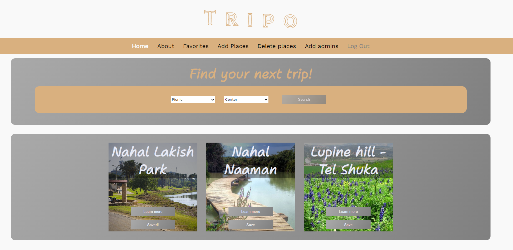
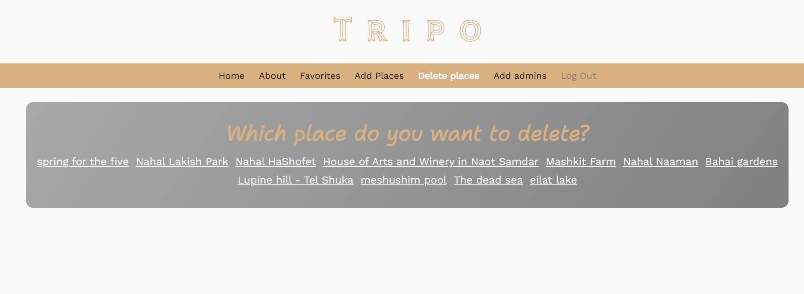
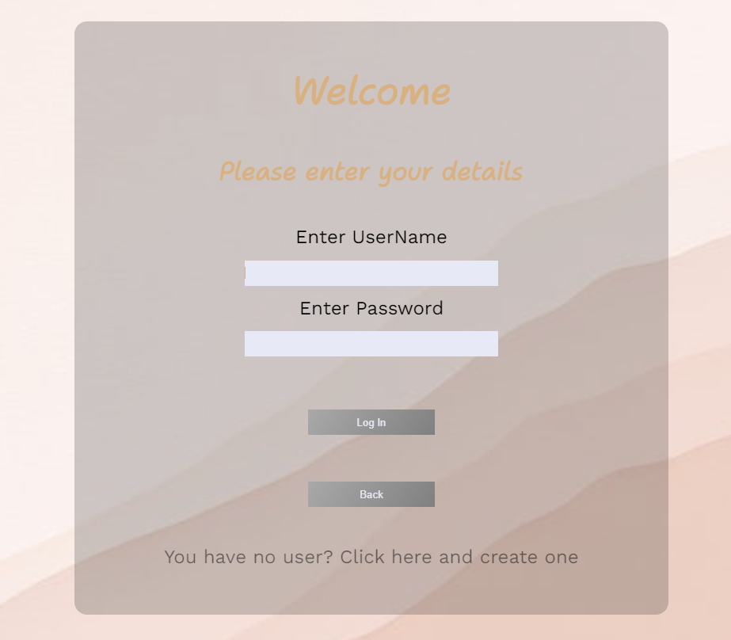

<h1>Mid-project</h1>
<h3>About:</h3>

This project Showcases all the skills i've learned in the Fullstack Bootcamp till now. 

In this app you can find your next experience easily, save places you like and share the places you have traveled to.

<h3>This project contains skills of: </h3>
<ul>
<li>HTML</li>
<li>CSS</li>
<li>JAVA SCRIPT</li>
<li>REACT</li>
</ul>
<h3>Contains technologies as:</h3>
<ul>
<li>Styled-Componenns</li>
<li>Muck API's</li>
<li>Axios</li>
<li>Context hook</li>
</ul>

Link to Netlify:

<h3>A little bit from the project...</h3>

